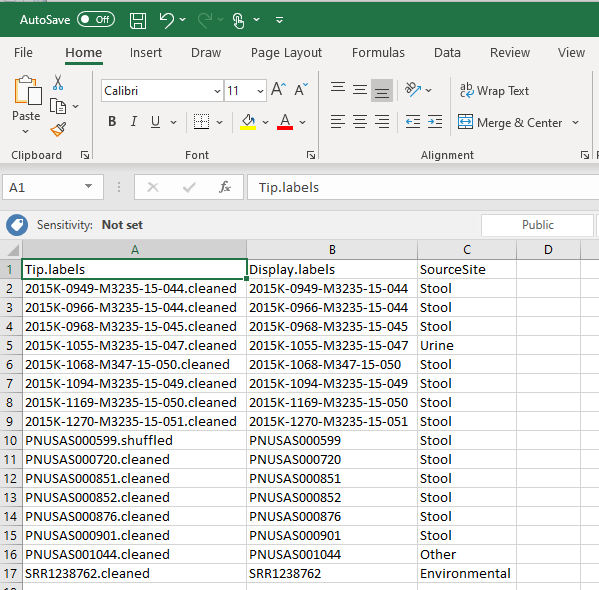
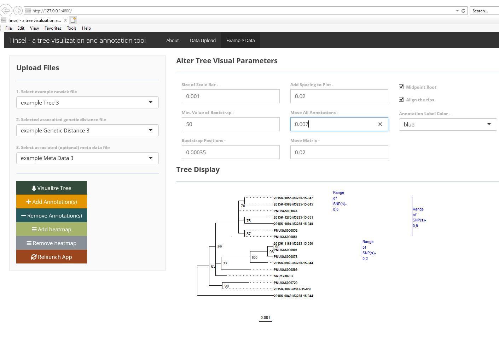

### What is tinselR?

tinselR at its' most basic level is a graphical viewer of newick-formatted 
phylogenetic trees and as an application for producing publication-ready 
figures. The **power** of tinselR comes with combining a genetic distance matrix 
for annotating a tree for epidemiological outbreak analyses. A genetic distance
matrix contains snp differences for all pairwise comparisons for the tips on 
the tree. One can also include a 
[heatmap](https://yulab-smu.top/treedata-book/chapter7.html) when that data is
provided in the meta data file.

### Issues, problems, suggestions, thoughts

If you have any the above, please submit an *issue* on github located 
[here](https://github.com/jennahamlin/tinselR/issues).

### Requires - 
 - [ggtree](https://bioconductor.org/packages/release/bioc/html/ggtree.html); 
 see the quick start for how to install ggtree. 
 - [treeio](http://bioconductor.org/packages/release/bioc/html/treeio.html); 
 which will install with ggtree.
 - R version >= 3.5


<!-- badges: start -->
[](https://travis-ci.com/jennahamlin/tinselR)
<!-- badges: end -->
<hr>

### Quick Start 

**1). Install devtools package** 

Run this code in your R console -     

`install.packages("devtools", dep=T)`

**2). Install ggtree and treeio**
```
if (!requireNamespace("BiocManager", quietly = TRUE))
    install.packages("BiocManager")

BiocManager::install("ggtree")
```

**3). Install and launch the tinselR shiny application**


```
devtools::install_github("jennahamlin/tinselR")
library(tinselR)
run_app()
```

**4). Load your data or use the example data**  

*Please click on the 'Data Upload' pane, where you can upload your files.*
*Example data is availale for playing with tinselR in the 'Example Data' pane of* 
*the application.* 

* **Phylogenetic Tree** - required; a 
[newick](https://en.wikipedia.org/wiki/Newick_format) generated tree 

* **Genetic Distance data** - optional for use with the annotation function;
a tsv/txt/csv file - see below for image of genetic distance matrix

<p>

<h4> genetic Distance screenshot </h4>
    
</p>

* **Metadata** - optional for easy correction of tip labels or adding a heatmap;
a tsv/txt/csv file - requires column headers of Display.labels and Tip.labels.
See image below for a csv file example 

<p>

<h4> meta Data screenshot </h4>
    
</p>

#### Once the phylogenetic tree is uploaded you can -
* Alter visualization parameters. See below for tree with aligned tips.  

<p>
    
</p>

#### Once the genetic distance file is uploaded you can -
* add annotation to the visual representation of the tree. See below for a tree
with annotated clades including the range of SNPs. 

<p>
    
</p>

#### If column for heatmap included in meta data file you can -
* add the heatmap on to a tree with or without annotations. See below for a tree
with annotated clades and a heatmap. 

<p>
    
</p>


**Known issues as October 23, 2020**

- If user uploads tree and genetic distance matrix and then annotates the tree, 
error pops up if user then tries to upload a meta data file. 

If you are interested in seeing the session info for the computer that developed
this application please visit this 
[link](https://github.com/jennahamlin/tinselR/issues/4). Here all packages and
versions that were installed on a windows machine are listed and successfully
runs tinselR.** 
