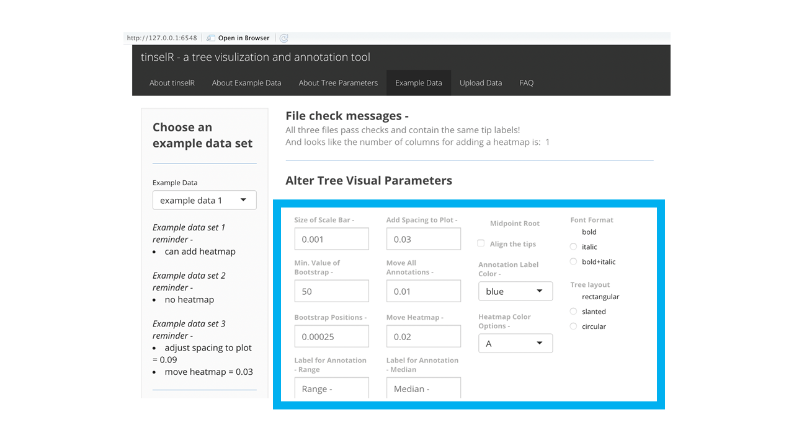

### What is tinselR?

tinselR (pronunced tinsel-er) at its’ most basic level is a graphical
viewer of Newick-formatted phylogenetic trees and as an application for
producing publication-ready figures. The **power** of tinselR comes with
combining a genetic distance matrix for annotating a tree for
epidemiological outbreak analyses. A genetic distance matrix contains
SNP differences for all pairwise comparisons for the tips on the tree.
One can also include a
[heatmap](https://yulab-smu.top/treedata-book/chapter7.html) when that
data is provided in the meta data file. When you are happy with the way the
image looks, you can download as either a pdf, png, or tiff.

### Issues, problems, suggestions, thoughts

If you have any the above, please submit an *issue on github located
[here]*(https://github.com/jennahamlin/tinselR/issues).

### Requires -

  - [ggtree](https://bioconductor.org/packages/release/bioc/html/ggtree.html);
    see the quick start for how to install ggtree.
  - [treeio](http://bioconductor.org/packages/release/bioc/html/treeio.html);
    which will install with ggtree.
  - R version \>= 3.5

<!-- badges: start -->

<!-- badges: end -->

### Quick Start

**1). Install devtools package**

Run this code in your R console -

`install.packages("devtools", dep=T)`

**2). Install ggtree and treeio**

    if (!requireNamespace("BiocManager", quietly = TRUE))
        install.packages("BiocManager")
    
    BiocManager::install("ggtree")
    
*Note - installation of ggtree should automatically cause treeio to install*

**3). Install and launch the tinselR shiny application**

    devtools::install_github("jennahamlin/tinselR@release-V0.0.0.90")
    library(tinselR)
    run_app()

**4). Load your data or use the example data**

Please click on the ‘Data Upload’ pane, where you can upload your
files.* *Example data is available for playing with tinselR in the
‘Example Data’ pane* *of the application. The example data sets
include all three files (tree,* *gene, and meta) and are available for
selection via one drop down menu

  - **Phylogenetic Tree** - required; a
    [Newick](https://en.wikipedia.org/wiki/Newick_format) generated tree

  - **Genetic Distance data** - optional for use with the annotation
    function; a tsv/txt/csv file - see below for image of genetic
    distance matrix.
    
  - **Metadata** - optional for easy correction of tip labels or adding
    a heatmap; a tsv/txt/csv file - requires column headers of
    Display.labels and Tip.labels. See image below for a csv file
    example.

**Examples of both the genetic distance matrix and the metadata file**

*Genetic Distance*

 

*Metadata File* 

 

**5). Alter or annotate your tree**

##### Once the phylogenetic tree is uploaded you can -

  - Alter visualization parameters. See below for part of a tree with aligned
    tips.

##### Once the genetic distance file is uploaded you can -

  - add annotation to the visual representation of the tree. See below
    for a tree with annotated clades including the range of SNPs.

##### If column for heatmap is included in metadata file you can -

  - add the heatmap on to a tree with or without annotations. See below
    for a tree with annotated clades and a heatmap.

**Known issues as October 23, 2020**

  - If user uploads tree and genetic distance matrix and then annotates
    the tree, and then selects a meta data file, all previously placed
    annotations are wiped from the tree image.

If you are interested in seeing the session info for the computer that
developed this application please visit this
[link](https://github.com/jennahamlin/tinselR/issues/4). Here all
packages and versions that were installed on a windows machine are
listed and successfully runs tinselR.
