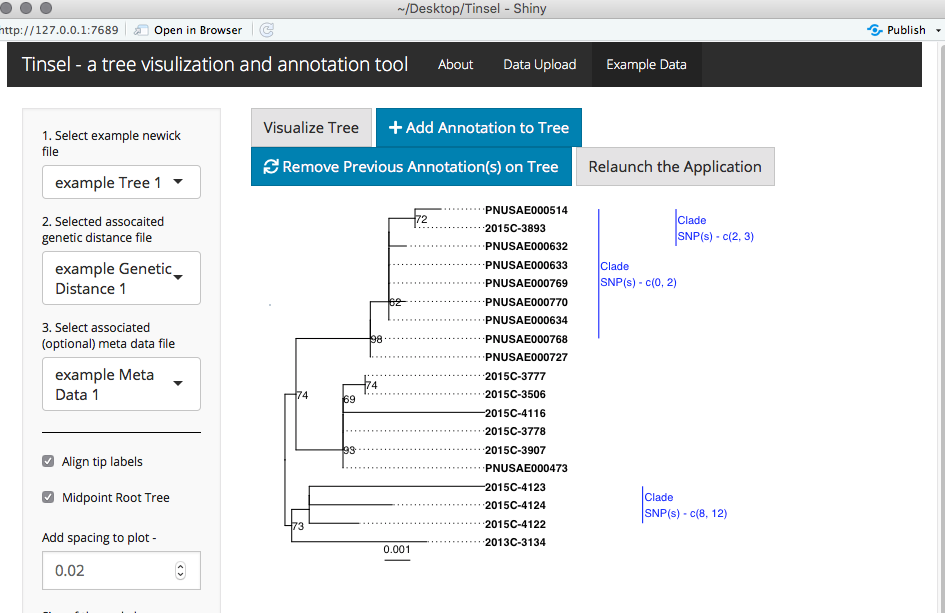
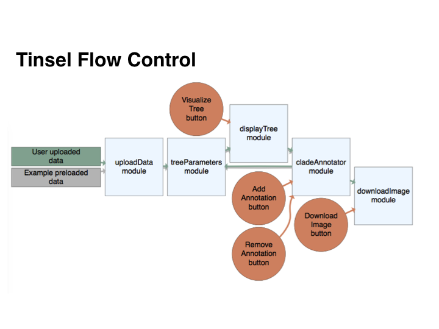

### What is Tinsel?

Tinsel at its' most basic level is a graphical viewer of newick-formatted phylogenetic trees and as an application for producing publication-ready figures. The **power** of Tinsel comes with combining a genetic distance matrix for annotating a tree for epidemiological outbreak analyses. A genetic distance matrix contains snp differences for all pairwise comparisons for the tips on the tree.  

### Issues, problems, suggestions, thoughts

If you have any the above, please file an *issue* on github located [here](https://github.com/jennahamlin/Tinsel/issues).

### Requires - 
 - tibble_2.1.3; problems arise if you use tibble_3.0.3 `devtools::install_version("tibble", version = "2.1.3")`
 - stringi_1.4.3; problems arise if you use stringi_1.5.3 `devtools::install_version("stringi", version = "1.4.3")`
 - [ggtree](https://bioconductor.org/packages/release/bioc/html/ggtree.html) 
 - [treeio](http://bioconductor.org/packages/release/bioc/html/treeio.html); which should install if you install ggtree first

<!-- badges: start -->
[](https://travis-ci.com/jennahamlin/Tinsel)
<!-- badges: end -->
<hr>

### Quick Start 

**1). Install devtools package** 

`install.packages("devtools", dep=T)`

**2). Launcning the Tinsel shiny application**

Run this code in your R console -     

```
devtools::install_github("jennhamlin/Tinsel")
Library(Tinsel)
run_app()
```  
**3). Load your data or use the example data**  

*Please click on the 'Data Upload' pane, where you will be able to upload your files or access example data on the 'Example Data' pane.* 

* **Phylogenetic Tree** - required; a [newick](https://en.wikipedia.org/wiki/Newick_format) generated tree 
* **Genetic Distance data** - optional for use with the annotation function; a tsv/txt/csv file
* **Metadata** - optional for easy correction of tip labels; a tsv/txt/csv file - needs column headers of Display.labels and Tip.labels 

#### Once the phylogenetic tree is uploaded you can -
* Alter additional visualization parameters in the sidebar panel on the left. See below for tree with aligned tips.  

<p>
    
</p>

#### Once the genetic distance file is uploaded you can -
* add annotation to the visual representation of the tree. See below for a tree with annotated clades including the range of snps. 

<p>
    
</p>

#### Tinsel Flow Control diagram 

<p>
    
</p>

**Known issues as September 23, 2020**

- If user uploads tree and genetic distance matrix and then annotates the tree, error pops up if user then tries to upload a meta data file. 

**Tinsel has been tested with**
* R version 3.6.0 


