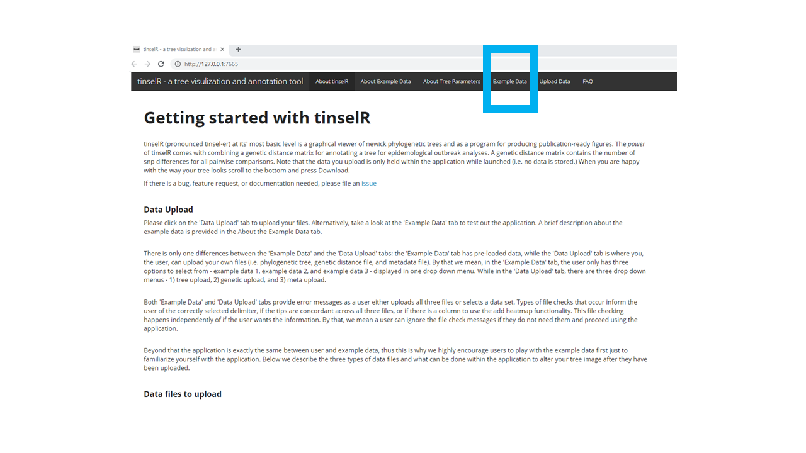

# Summary
Across the United States, public health laboratories at the state-level now
perform whole-genome sequencing for many pathogens, a milestone for protecting 
our public health by identifying organisms at a higher resolution than
previously [@armstrong2019pathogen]. To understand organismal relationships
in response to an outbreak investigation, building, and interpreting phylogenetic 
trees is an essential component for this public health workflow. Placing 
new outbreak isolates within the broader context of within-species diversity 
identifies similarities or differences across temporal or spatial scales 
regarding these newly sequenced isolates [@pybus2013evolutionary]. Thus, our
goal was to develop an open-source graphical user interface for phylogenetic
tree visualization and annotation primarily for external partners (e.g. state
public health laboratories) but also internal users (i.e. Centers for Disease
Control and Prevention). To make our application broadly usable and given that
many state public health laboratories have limited bioinformatics support, one
of our main developmental focal points was that an application be both free and
easily installable. To accomplish this, we used the Rshiny framework
[@chang2017shiny] to develop **tinselR** (pronounced tinsel-er). Beyond the
above requirements listed, the R programming language also contains some of the
gold standard packages for phylogenetic analyses and visualization (e.g. ape
[@paradis2004ape], and ggtree [@yu2017ggtree]). tinselR's minimum input
requirements are a Newick formatted phylogenetic tree and once loaded,
user-selected inputs change parameters of the visualized tree. For example, a
user can quickly transform tip labels to either bold or bold and italic font
format. With a genetic distance matrix or the metadata file, or both, the user
can include annotations on the image, automatically change the tip labels,
or add a heatmap to the phylogenetic tree. These modified tree images
are downloadable in various formats (pdf, png, or tiff) for presentations or
publications. Ultimately, these images help public health officials and 
stakeholders communicate in response to outbreaks. Below, we detail how to
install the application and describe the example data that is pre-loaded so
that a new user can familiarize themselves with the application.

# Installation

As tinselR is currently hosted on github, users will need to download the
R package devtools [@wickham2016devtools] along with ggtree [@yu2017ggtree] and
treeio [@wang2020treeio]. Both ggtree and treeio are hosted on Bioconductor 
project and can be accessed with BiocManager [@morgan2019biocmanager]. Once
those complete installing, tinselR can be installed via install_github command
from devtools. Below we provide explicit code for installing the  application.
The final line of code below (run_app()), will launch the application. Note that
when the install_github command is run, additional packages required for the
application will be installed as well. 

**1). Install devtools package**

Run the below code in your R console -    

`install.packages("devtools", dep=T)`

**2). Install ggtree and treeio**

```
if (!requireNamespace("BiocManager", quietly = TRUE))
install.packages("BiocManager")
BiocManager::install("ggtree")
```

**3). Install and launch the tinselR shiny application**

```
devtools::install_github("jennahamlin/tinselR")
library(tinselR)
run_app()
```

# Acceptable Inputs

Any program that generates a phylogenetic tree in the Newick format can be used.
For example, RAxML [@stamatakis2014raxml] outputs trees in Newick format and
thus are acceptable inputs of a user uploaded tree. Currently, our application
only supports a genetic distance matrix of single nucleotide polymorphisms (SNP)
differences between tips on the tree. A genetic distance matrix can be in either
csv, tsv, or txt formats. The metadata file should be in one of these formats as
well (csv, tsv, or txt). The primary use of the metadata file is, once loaded,
will automatically convert tip labels in the phylogenetic tree to whatever you 
want. For example, many tip labels in a tree can include information that is not
informative or is repetitive. Using a minimum of two columns with column headers
Tip.labels, and Display.labels (column 1 and column 2 respectively), the column
Tip.labels represents the tip labels in the phylogenetic tree that is uploaded.
While the column Display.labels represents what the tip labels should display.
Once this file is uploaded along with a phylogenetic tree, the switch between 
Tip.labels and Display.labels happens instantaneously. A secondary function of
the metadata file is the possible inclusion of information to be displayed as a 
heatmap next to the tree. For example one may want to include information about 
the collection site if that varies by isolates. If this third column is included
in the metadata file, the header of column can be titled anything that the user
wants to be displayed. 

# About Pre-loaded Example Data

When tinselR is launched, the user can test out the application by using one of
the pre-loaded datasets located in the 'Example Data' tab (Figure 1). We provide
three datasets (i.e. Newick formatted tree, genetic distance matrix, and
metadata file). These data are either *Eschericia coli* (from NCBI Bioproject:
PRJNA218110) or *Salmonella enterica* (from NCBI Bioproject: PRJNA230403) 
with the number of isolates ranging from 14 - 19. After clicking on the
'Example Data' tab, users can select from the drop down menu one of the datasets
(e.g. example data 1, example data 2, and example data 3 (Figure 2).
Using example data set 1, we highlight the capabilities of tinselR (Figure 3). 

# Figures

<p>

<h4> Figure 1: tinselR landing page with the example data tab indicated in the blue box. </h4>
</p>

<p>

<h4> Figure 2: Example data tab with action buttons and the location of the drop-down menu for the example data. Here example data set 1 is selected. </h4>
</p>

<p>

<h4> Figure 3: Example dataset 1 displayed with annotations and a heatmap indicating collection source. </h4>
</p>

# Development for local-user experience 

One note regarding tinselR, to keep in mind, is that the application has only
been tested by single-user instances. If one hosts the application on a server, 
then testing if multiple users can access the application should be done before
providing access.

# Acknowledgements

This publication was supported by Cooperative Agreement Number U60OE000103, funded by Centers for Disease Control and Prevention through the Association of Public Health Laboratories. Its contents are solely the responsibility of the authors and do not necessarily represent the official views of Centers for Disease Control and Prevention or the Association of Public Health Laboratories.

# References
