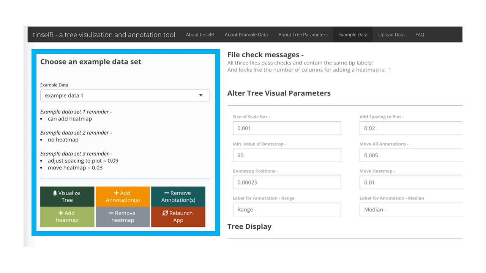
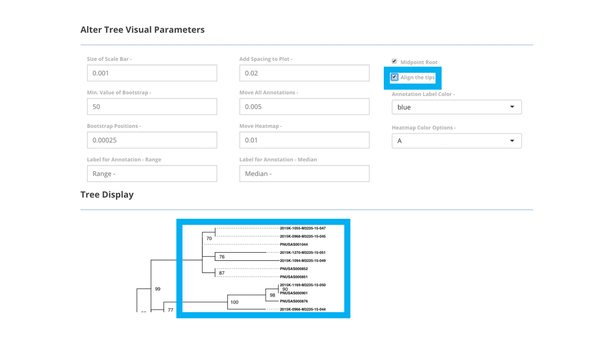
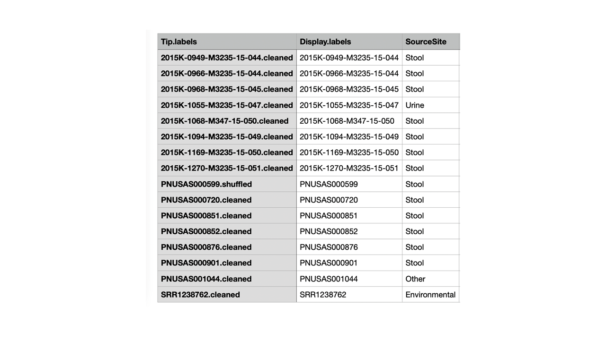
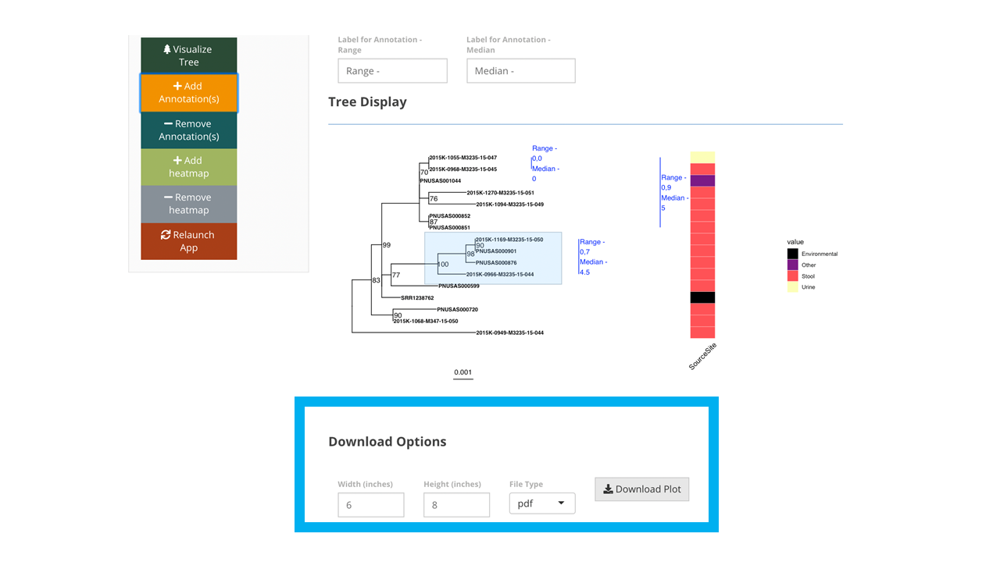

```{r, include = FALSE}
knitr::opts_chunk$set(
  collapse = TRUE,
  comment = "#>"
)
```

```{r setup, results='hide', message=FALSE, warning=FALSE}
library(tinselR)
```

### Why tinselR

Across the United States, public health laboratories perform whole-genome
sequencing for many pathogens, a milestone for protecting public health by
subtyping organisms at a higher resolution than was previously possible. These
high resolution subtypes can be used to determine the relationships between
organisms, which can be visualized with phylogenetic trees. Once the
phylogenetic relationships of pathogens are known, empirically derived
thresholds can be used to identify possible outbreaks, and additional
epidemiological data can be added to the visualization. In combination, these
data can be used to inform the design of investigations, to confirm the
occurrence of an outbreak, and identify potential transmission routes. If
appropriate, interventions such as the recall of contaminated products and
public announcements may be issued. Thus, creation and markup of phylogenetic
trees is an essential component for this public health workflow. Our goal was to
develop an open-source graphical user interface (GUI) for phylogenetic tree
visualization and annotation usable by persons without specialized
bioinformatics or data visualization skills. Given that the R programming
language contains some of the gold standard packages for phylogenetic analyses
and visualization (e.g. ape, and ggtree), we used the Rshiny framework to
develop tinselR (pronounced tinsel-er) to provide GUI access to the tools in
ape, ggtree, and other key packages. tinselR's minimum input requirement is a
Newick formatted phylogenetic tree. Once loaded, user-selected inputs change the
appearance of the displayed tree. For example, a user can quickly transform tip
label formatting. By adding a genetic distance matrix or metadata file or both,
the user can include annotations on the image, relabel tips, or add a heatmap to
the phylogenetic tree. These modified tree images are downloadable in various
formats (pdf, png, or tiff) for presentations, publications, or other
communications with collaborators. Below we will detail and outline how to use
the application, using one of the example datasets.

### Getting started

#### *Testing with example data*

##### Example data

When the application is launched, the user can test out the application by
using one of the pre-loaded datasets located in the 'Example Data' tab (Figure
\@ref(fig:exampleDataPane1)). We provide three datasets (i.e. Newick-formatted
tree, genetic distance matrix, and metadata file) already combined with the
number of isolates ranging from 14 - 19. These data are either *Eschericia coli*
(NCBI Bioproject: PRJNA218110) or *Salmonella enterica* (NCBI Bioproject: 
PRJNA230403). After clicking on the 'Example Data' tab
(Figure \@ref(fig:exampleDataPane1)), the user selects from the drop down menu
one of the combined datasets (e.g. example data 1, example data 2, and
example data 3; - see Figure \@ref(fig:exampleDataPane2)). 


```{r exampleDataPane1, echo = F, out.width = "100%", fig.cap = "Landing page for tinselR with 'Example Data' tab highlighted in blue."}
knitr::include_graphics("Slide1.PNG")
```
<br>
<br>
```{r exampleDataPane2, echo = F, out.width = "100%", fig.cap = "Pre-loaded example dataset 1 is selected and can be seen once the user presses the 'Visaulize Tree' button."}

```
<br>
<br>
**Displaying example tree and genetic distance data**

Once you have selected one of the datasets, to begin using the application, 
press the 'Visualize Tree' button. At this point all potential tree visual
parameters you want to alter are available using drop down menus
(e.g. annotation label color), user input (e.g. size of scale bar), or 
users selection (e.g. midpoint root). All tree visual parameters that a user 
can adjust are displayed in Figure \@ref(fig:exampleDataPane3). In Figure \@ref(fig:exampleDataPane4), part of a phylogenetic tree is displayed with the 
tips right aligned after checking the box available in the alter tree visual 
parameters. 
<br>
<br>
```{r exampleDataPane3, echo = F, out.width = "100%", fig.cap = "'Example Data' tab with available tree visual parameters highlighted within the blue box."}
knitr::include_graphics("Slide3.PNG")
```
<br>
<br>
```{r exampleDataPane4, echo = F, out.width = "100%", fig.cap = "Pressing 'Visualize Tree' button will allow the tree to be viewed on screen. Within the larger blue box, part of a phylogenetic tree is displayed with tips right aligned. The smaller blue box indicates that the 'align the tips' box has been selected."}

```
<br>
<br>
With the genetic distance file uploaded, a user can highlight clades to 
add annotations, which will display the range and median of single Nucleotide 
polymorphismss (SNPs) for tips that are included in the highlighted selection (Figure \@ref(fig:exampleDataPane5)). To ensure the correct display of the annotation, the user should highlight the tips of interest and include within the highlighted section their most recent common ancestor, (Figure \@ref(fig:exampleDataPane5)). In theory, one can add as many annotations as you want, though at some point the annotations may run off the plot area and thus you may need to add more space to plot (Tree visual parameter - 'Add Spacing to Plot'). The ability to change spacing to the plot is one of the tree  visual parameters that can be adjusted (Figure \@ref(fig:exampleDataPane3)). We would also recommend to only include those that help describe the outbreak clades of interest. Any annotation placed on the plot can be removed by pushing the 'Remove Annotations' button (Figure \@ref(fig:exampleDataPane5)). Unlike with the 'Add Annotation' button, you do not need to highlight which annotation you would like to remove. Essentially this removes annotations by removing the last placed annotation until there are no more. 
<br>
<br>
```{r exampleDataPane5, echo = F, out.width = "100%", fig.cap = "With tips of interest highlighted, pressing the 'Add Annotations' button will add annotations to the tree image, which indicate the range and median of SNPs for these tips of interest. The tree with annotations is within the larger blue box, while the buttons for adding/removing annotations are in the smaller box on the left of image. "}
knitr::include_graphics("Slide5.PNG")
```
<br>
<br>
**Included example metadata for tip correction and heatmap**

Figure \@ref(fig:exampleDataPane6) provides an example metadata file with 
three columns: 1) 'Tip.labels'; those tip labels within in the Newick-formatted
tree, 2) 'Display.labels'; what you would like the tip labels in the tree to be
changed to, and 3) an optional column label whatever that column reflects. Here, the third column is called 'SourceSite' indicating the collection site of the isolates. When the metadata is included and a user pushes the 'Visualize Tree' button, automatic tip correction occurs, meaning that the tips within the Newick-formatted tree convert to what you the user decided  (e.g.
'Display.labels' column in metadata file). The ability to add a [heatmap](https://yulab-smu.top/treedata-book/chapter7.html),
allows the user to include either categorical or numerical data for their tree 
image either with or without annotations
(Figure \@ref(fig:exampleDataPane7)). 
<br>
<br>
```{r exampleDataPane6, fig.align="center", echo = F, out.width = "75%", fig.cap = "Example metadata 1 with the third column included with information used for adding a heatmap. "}

```
<br>
<br>
```{r exampleDataPane7, echo = F, out.width = "100%", fig.cap = "Tree image with annotations and a heatmap of collection source displayed within blue box. The add heatmap is also within the blue box on the left of the image."}
knitr::include_graphics("Slide7.PNG")
```
<br>
<br>
**Downloading your image**

Once you are happy with the way your tree looks, you can download the image 
in either pdf, png, or tiff formats (Figure \@ref(fig:exampleDataPane8)). Make 
sure you adjust the height and width of the image that you download. Note that
once the image has downloaded, if you want to re-download with anything changed, just adjust as you wish and push the 'Download' button again.

```{r exampleDataPane8, echo = F, out.width = "100%", fig.cap = "Tree image with annotations and a heatmap of collection source displayed. The download image options is within the blue box on the bottom of the image."}

```
<br>
<br>

#### Using your data

##### Differences between example data tab and upload data

There are only two differences between the 'Example Data' and the 'Data Upload'
tabs: the example data tab has pre-loaded data, while the data
upload tab is where you, the user, can upload your own files (i.e. tree, 
genetic distance, and metadata). By that we mean, in the 'Example Data' tab,
the user only has three options to select from - example data 1, example data 2, and example data 3 - displayed in one drop down menu. While in the 'Data Upload' tab, there are three drop down menus - 1) tree upload, 2) genetic upload, and 3)meta upload (Figure \@ref(fig:userDataPane1)). The only required file is the Newick-formatted tree, the other two files are optional. 
<br>
<br>
```{r userDataPane1, echo = F,out.width = "100%", fig.cap = "'Data Upoad' tab for user's own data upload The larger blue box contains the three dropdown menus for the three different files a user can upload. The smaller blue boxes indicates the 'Data Upload' tab."}
knitr::include_graphics("Slide9.PNG")
```
<br>
<br>
Second, given problems that can occur during user upload, we provide file upload error messages in hopes of helping, you the user, with checking that all three files are concordant in terms of tip label information. As these concordant tip labels are the main mechanism of connecting the three files. If there is variation in the three files, a message will be displayed to the user regarding how the file tip labels differ. File checking happens independently of if the user wants the information. By that we mean, a user can ignore the file check messages if they do not need them and proceed using the application. Please note that this concordant tip checking will only display a complete message if all three files are uploaded (tree, genetic, and meta). Beyond these two things, the application is exactly the same between the example data tab and the upload data tab, thus this is why we highly encourage users to play with the example data first to familiarize yourself with the application. 

##### File types and format for uploaded data
The application relies on treeio's function read.newick (`treeio::read.newick`),to read in a Newick-formatted tree. treeio is associated with the package ggtree, which extends the ggplot2 plotting system to phylogenetic trees. In theory, any application  that can produce a Newick-formatted tree should be able to be uploaded. The tip labels in the Newick tree, distance matrix, and metadata files must match before upload. The genetic distance matrix file must contain a square matrix of single nucleotide polymorphism (SNP) differences between the tree tips (Figure \@ref(fig:userData2)). The metadata file is a table of additional information to be changed or displayed on the tree. The primary function of the metadata file is to relabel the tips on the tree image. The header of the first column must be Tip.labels, and it must contain the labels for all tree tips in the uploaded Newick file (Figure \@ref(fig:exampleDataPane6)). The alternative identification labels can be provided in the metadata file using the column header Display.labels in column two. If desired, users may include additional columns in the metadata file, such as the collection site (Figure \@ref(fig:exampleDataPane6)), and display the information in a heatmap next to the tree. Headers for these other columns in the metadata file are flexible because they are not automatically recognized and used by tinselR. Acceptable formats include CSV, TSV, and TXT for the genetic distance and metadata files. Users can set file types independently for each input.
<br>
<br>
```{r userData2, echo = F, out.width = "75%", fig.align="center", fig.cap = "Genetic distance matrix example with tip labels that match the Newick phylogenetic tree."}
knitr::include_graphics("Slide10.PNG")
```
<br>
<br>

### Caveats
Note, we have only tested the application using trees with ~ 30
tips with success, beyond that tip number we are interested to see how the application does, so please do let us know. 

Another caveat is that if the user does this specific sequence of steps,
the tree image will be wiped and not include clade annotations already drawn 
on the tree. However, we expect this sequence of events to rarely happen. 

**Order of events - **

* upload phylogenetic tree
* upload genetic distance matrix
* annotate tree 
* upload metadata - after this file is uploaded all annotations drawn on the 
tree will be removed. 

### Getting Help

If you have problems, requests, or thoughts, please file an 
[issue](https://github.com/jennahamlin/tinselR/issues).

